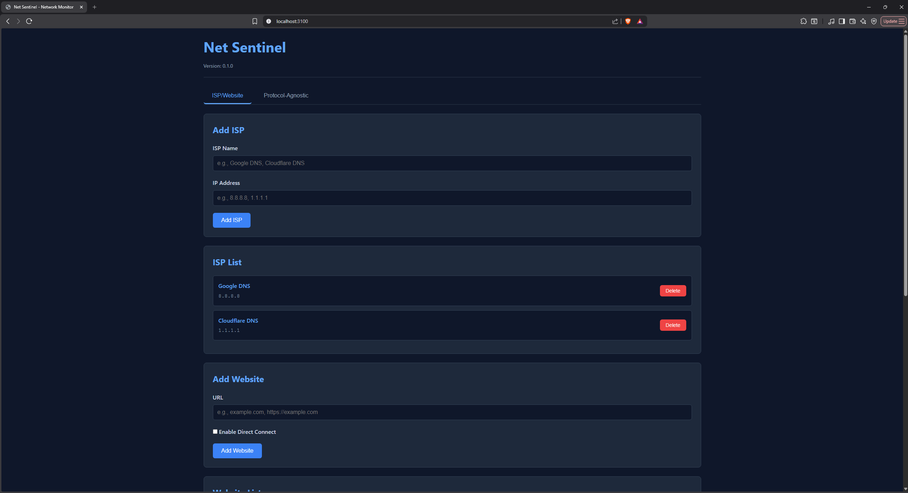

# Net Sentinel - Overview

## What is Net Sentinel?



Net Sentinel is a network monitoring tool that checks the health and status of:
- **ISPs** (Internet Service Providers) - to verify internet connectivity
- **Websites** - to check if websites are accessible
- **Game Servers** - to monitor game server status using custom protocols

## Key Features

### 1. ISP Monitoring
Net Sentinel can check multiple ISP endpoints to determine if your internet connection is working. It tests connectivity to various IP addresses and reports whether the internet is up or down.

### 2. Website Monitoring
Monitor any website's availability. You can check:
- External connectivity (normal HTTP/HTTPS requests)
- Direct IP connectivity (bypassing DNS)

### 3. Game Server Monitoring
The most powerful feature: monitor game servers using **pseudo-code scripts**. These scripts allow you to:
- Send custom packets to game servers (TCP/UDP protocols)
- Send HTTP/HTTPS requests to REST APIs and web services
- Parse server responses (binary packets or HTTP responses)
- Extract server information (player count, version, etc.)
- Format results for Prometheus metrics

## What is Pseudo-Code?

**Pseudo-code** is a simple scripting language that lets you describe:
1. **What packets to send** to a game server (or HTTP requests for REST APIs)
2. **How to parse the response** from the server
3. **How to format the output** for monitoring

Instead of writing complex Rust code, you write simple, readable instructions like:

**For TCP/UDP protocols:**
```
PACKET_START
WRITE_BYTE 0xFF
WRITE_STRING "status"
PACKET_END

RESPONSE_START
READ_STRING_NULL server_info
RESPONSE_END
```

**For HTTP/HTTPS protocols:**
```
HTTP_START REQUEST GET /api/status
HEADER Authorization Bearer token123
HTTP_END

RESPONSE_START
EXPECT_STATUS 200
READ_BODY_JSON response
RESPONSE_END
```

This makes it easy for anyone to create monitoring scripts for different game server protocols and REST APIs without needing to know Rust or low-level networking.

## How It Works

1. **You write a pseudo-code script** describing the protocol
2. **Net Sentinel parses the script** and converts it into executable code
3. **The script is executed** - packets are sent, responses are received
4. **Results are formatted** and exposed as Prometheus metrics
5. **You can view results** via the web interface or Prometheus endpoint

## Architecture Overview

```
┌─────────────────┐
│  Pseudo-Code    │  ← You write this
│     Script      │
└────────┬────────┘
         │
         ▼
┌─────────────────┐
│  Parser         │  ← Converts script to commands
│  (packet_parser) │
└────────┬────────┘
         │
         ▼
┌─────────────────┐
│  Packet Builder │  ← Builds binary packets
└────────┬────────┘
         │
         ▼
┌─────────────────┐
│  Network Layer   │  ← Sends/receives via TCP/UDP/HTTP/HTTPS
│  (gameserver)    │
└────────┬────────┘
         │
         ▼
┌─────────────────┐
│  Response Parser│  ← Extracts data from response
└────────┬────────┘
         │
         ▼
┌─────────────────┐
│  Output Formatter│ ← Formats for Prometheus
└────────┬────────┘
         │
         ▼
┌─────────────────┐
│  Metrics        │  ← Available at /metrics
└─────────────────┘
```

## Getting Started

1. **Read the beginner's guide**: [01-beginners-guide.md](01-beginners-guide.md)
2. **Learn the pseudo-code syntax**: [02-pseudo-code-syntax.md](02-pseudo-code-syntax.md)
3. **See examples**: [03-examples.md](03-examples.md)
4. **Understand how it works**: [04-how-it-works.md](04-how-it-works.md)

## Next Steps

- [Beginner's Guide to Writing Pseudo-Code](01-beginners-guide.md) - Start here if you're new
- [Pseudo-Code Syntax Reference](02-pseudo-code-syntax.md) - Complete command reference
- [Examples and Tutorials](03-examples.md) - Real-world examples
- [How It Works Internally](04-how-it-works.md) - Deep dive into the implementation

